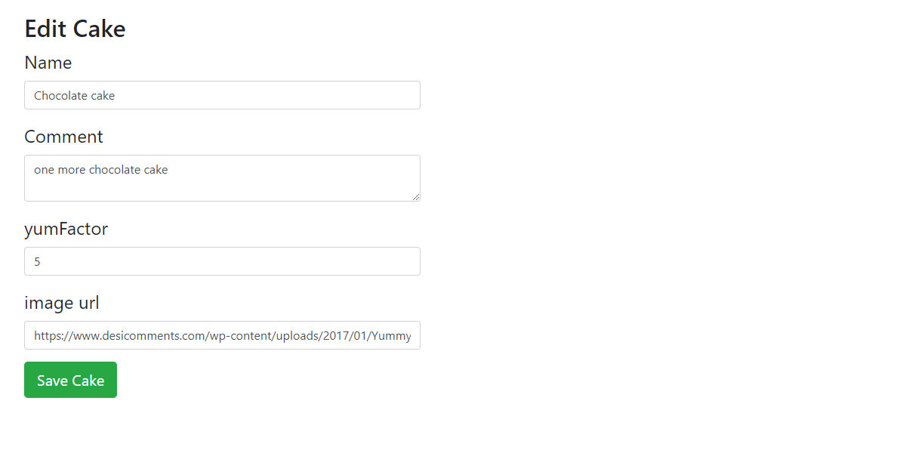

# 

## About

>React-Redux RESTfull API app that allows reading, adding, removing and updating items. In this case - cakes.

## Installation and running

>npm install - to install dependencies (Node.js )
npm start - to run the application (Webpack build will be created and webpack-dev-server will launch the applcation on port 3000)

## Images

### List View

### Single View

### Add View

### Edit View
